

# Lumina

**面向科研的桌面端论文阅读工具 —— 让阅读、批注与检索在同一界面中完成。**

[English](README.en.md) | [简体中文](README.md)

---

## 功能特性

### 论文阅读

导入 PDF 论文后，Lumina 会通过智谱 GLM-OCR 自动识别其中的文字、公式、表格与图注，将双栏论文重排为清晰易读的单栏版式，不用再对着 PDF 眯眼睛。目录面板点击直达章节，全文搜索、KaTeX 公式渲染、宽表格横向拖拽一应俱全，还可以一键切回原始 PDF 对照。阅读进度（含缩放级别与译文开关）自动记住，论文数据全部保存在你的设备上。

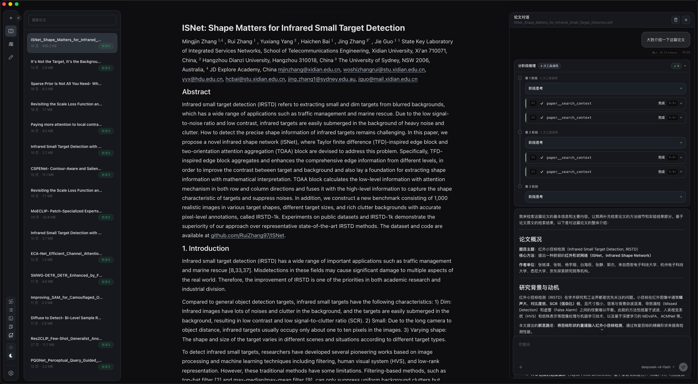

### 双语翻译

整篇论文一键翻译，译文逐段跟在原文下方形成对照，随时开关，图注也会一并翻译。翻译使用你自己配置的 OpenAI 兼容模型，可为论文阅读单独指定翻译模型；对不满意的段落可以单独重译，译文视图中的高亮与原文位置自动保持同步，译文开关状态也会随阅读进度一并记住。

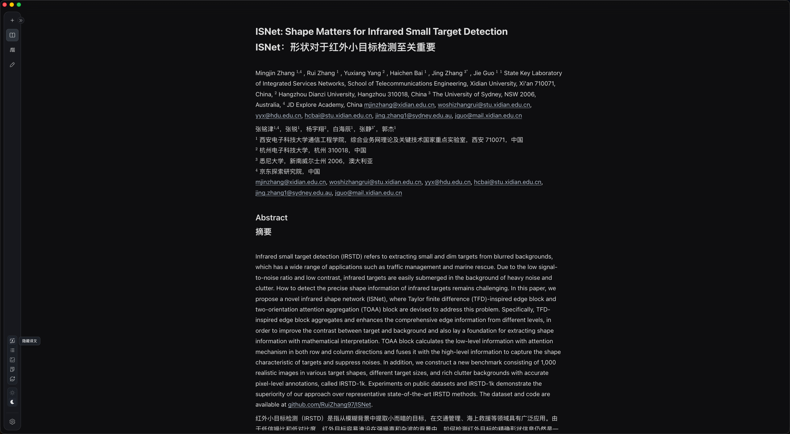

### 高亮与笔记

用蓝、黄、橙三种颜色高亮任意段落，或为选中的内容随手记录笔记。笔记依托语义锚点与原文位置自动锚定，滚动翻页也不会跑偏；笔记会自动汇入文件资源池，可挂载进知识库供日后检索。

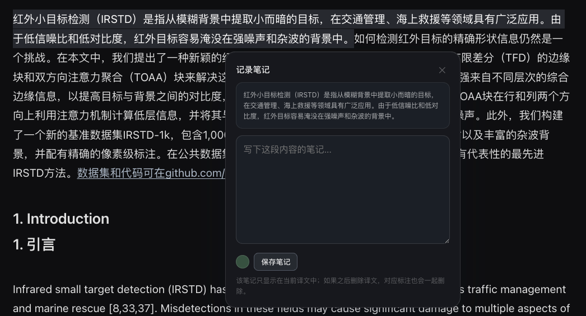

### 图表库

论文中带图注的插图会被自动提取，汇总成可浏览的图库面板。点击即可打开浮动预览窗口——可拖拽移动、缩放大小、钉住对照阅读，用方向键在图表间切换；开启译文后，图注也会显示对应译文。

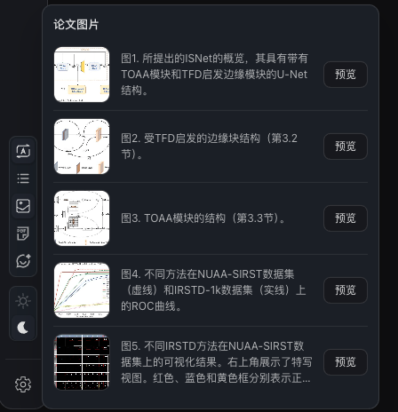

### AI 交互阅读

边读边问：AI 会按需检索当前论文的原文与译文，回答紧贴你正在研读的文本，适合精读、文献综述和思路探讨；选中段落可以直接引用提问，也可以上传文档与图片附件。兼容任意 OpenAI 兼容端点，支持配置多个服务商并按需切换，推理模型的完整思考过程可展开查看，每条回答的 token 用量与缓存命中率一目了然。

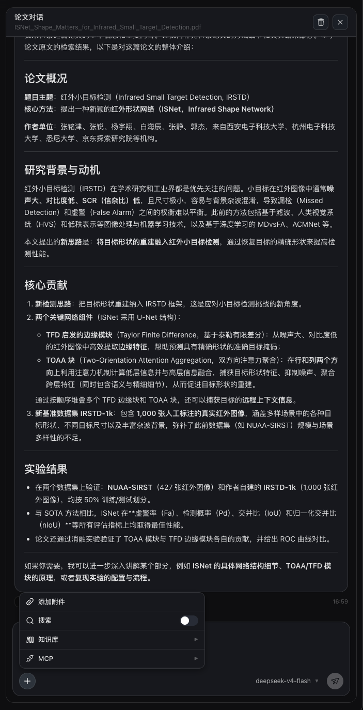

### 知识库

导入 PDF、Word、Excel、PowerPoint、Markdown、TXT、CSV 等文档，Lumina 会自动提取、分块并向量化内容。每个知识库可独立选择嵌入模型（内置 OpenAI、Ollama 本地、阿里云百炼等预设，也支持任意 OpenAI 兼容服务）与分块策略，分块数量、索引进度与存储占用一目了然，还可用搜索测试验证召回质量。对话中勾选目标库后，AI 会自主判断是否需要检索、检索哪些内容，而不是机械地全文搜索；阅读论文时写下的笔记也会汇集到这里。知识库还能一键作为 MCP 服务开放给 Claude Desktop 等外部应用调用。

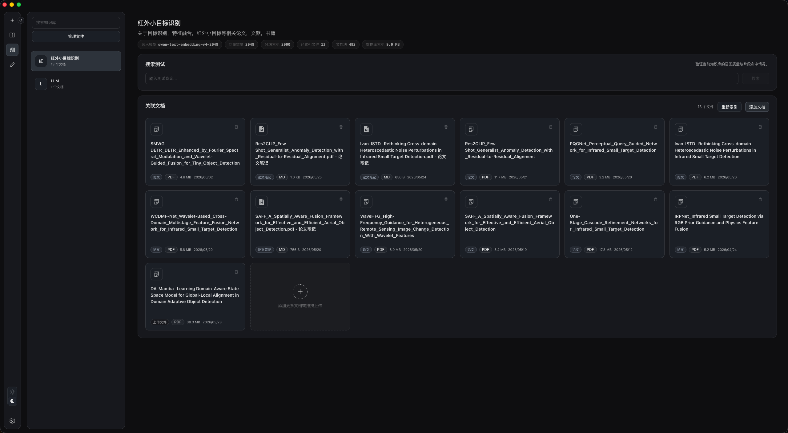

### 写作工作区

一个专注的富文本编辑器，用于撰写你自己的文稿：斜杠菜单可插入标题、列表、表格、代码块、脚注等十余种块，LaTeX 行内与块级公式实时预览，大纲面板掌握全文结构，文稿库支持文件夹分组，自动保存状态实时可见。AI 写作助手随时在侧——选中文字即可改写或续写，AI 生成的编辑建议在编辑器内逐条预览，可逐项接受或拒绝。写完即可导出为 Word、PDF 或 Markdown，公式与脚注在 Word 中保持原生格式。

### 工具扩展

通过 MCP（Model Context Protocol）连接外部工具服务，支持 stdio、SSE 与 Streamable HTTP 三种传输方式，可直接粘贴 Claude Desktop 格式的 JSON 配置快速接入，每个服务都可单独测试连接。连接后，AI 可在对话中并行调用多个工具来扩展能力；设置中心内置工具调用统计，调用量、成功率与耗时分布清晰可见。

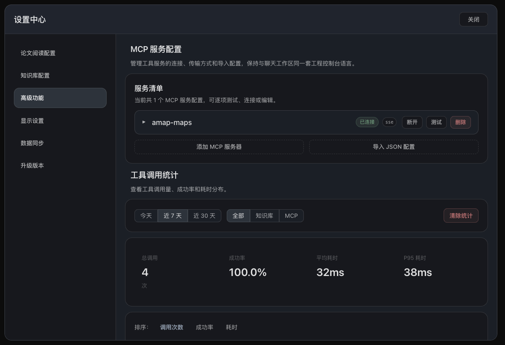

### 端到端加密同步

论文、会话、知识库、文稿与配置五类数据在多台设备间保持同步：对端变更经 WebSocket 实时推送，60 秒轮询兜底，各领域的同步明细实时可见。所有数据在上传前于本机完成 XChaCha20-Poly1305 端到端加密，密钥由你的密码经 Argon2id 派生——服务器只存密文，永远无法查看你的内容。新设备用同一账号登录后，输入六位同步码即可并入同步组；大文件分块加密传输。

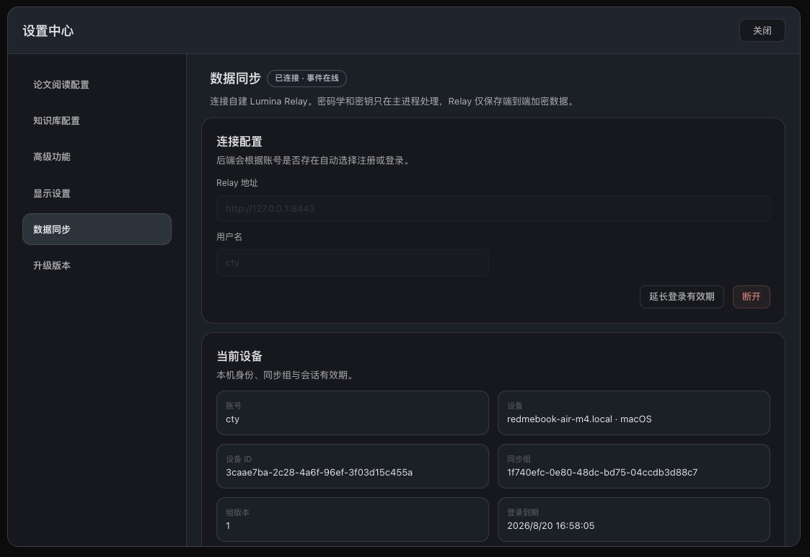

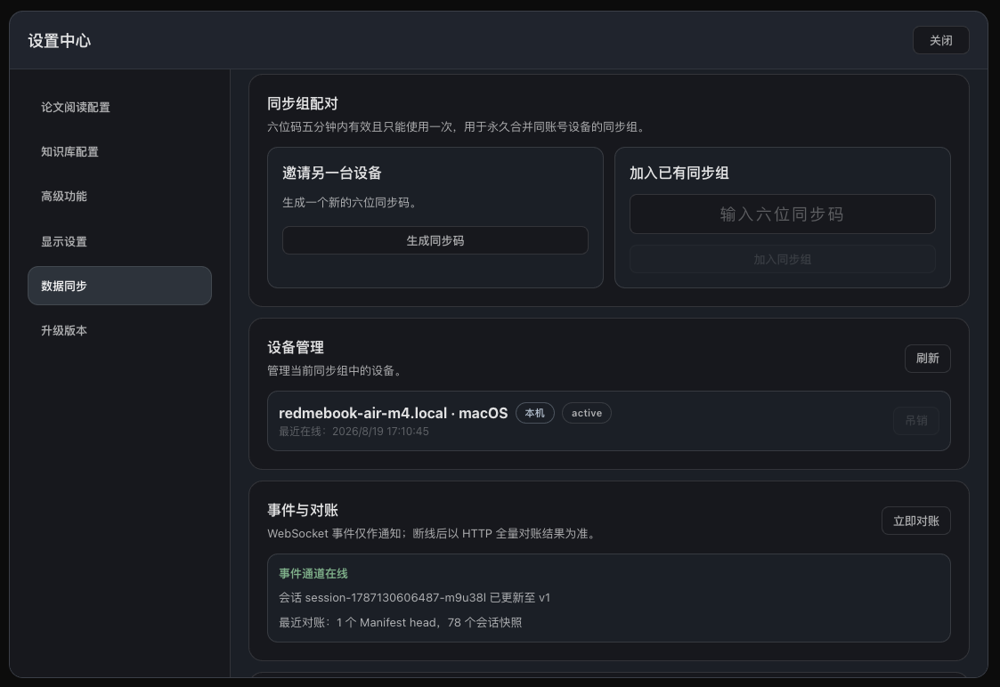

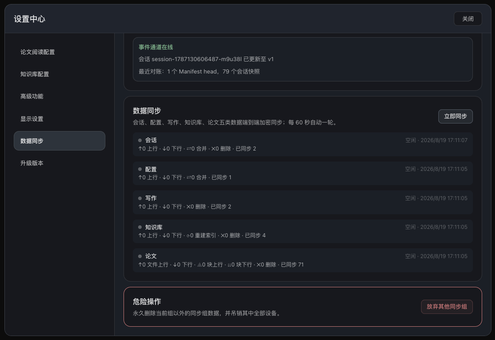

### 主题与语言

为深夜阅读精心调校的深色主题（默认）与适配明亮环境的浅色主题，可一键开启跟随系统；主题在界面渲染前预加载，切换无闪烁。界面提供中文与 English 两种语言，未显式选择时默认跟随系统，切换后立即生效。

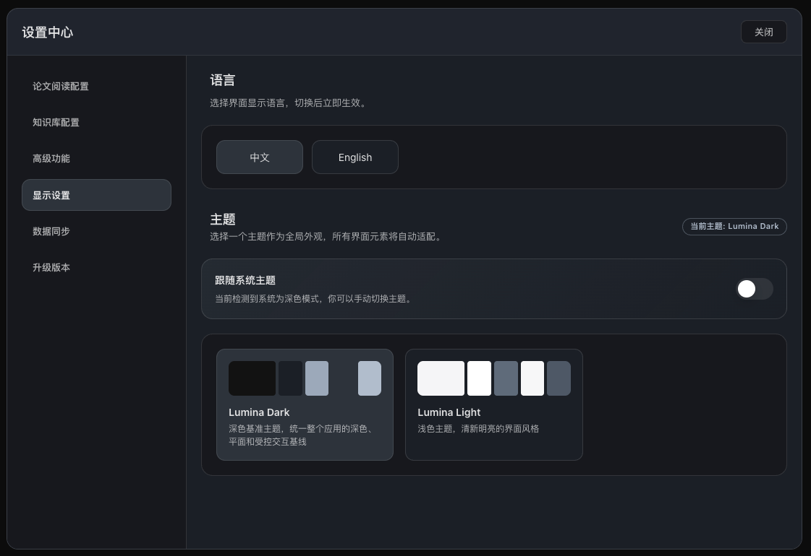

---

## 下载安装

从 [Releases](https://github.com/Tianyi822/Lumina/releases) 页面下载最新版本。

- macOS（`.dmg`）
- Windows（`.exe`）

> **提示：** 论文识别（OCR）与 AI 功能需要在首次启动后，于设置中配置相应的 API Key。

---

## 自部署同步服务

多设备同步由开源中继服务 **[Lumina-Relay](https://github.com/Tianyi822/Lumina-Relay)** 提供。

- 所有数据在设备上完成端到端加密后才上传，服务器只存储密文，无法查看你的内容。
- 服务端开源，但需要**自行部署**——本项目不提供公共服务器的托管。

---

## 开源协议

[GPL-3.0](LICENSE)

## 参与贡献

欢迎提交 Pull Request。Commit message 请遵循 [Conventional Commits](https://www.conventionalcommits.org/) 规范。
